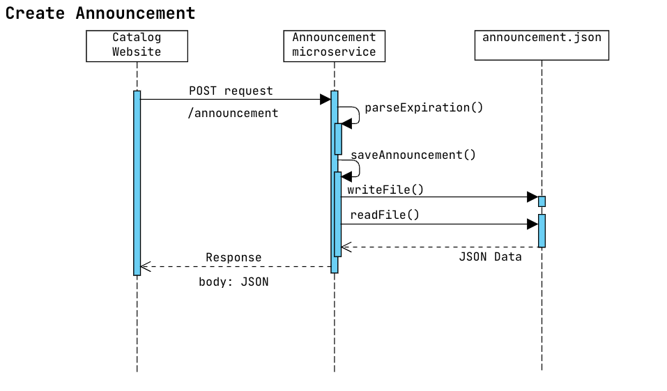

# announcement_ms

An announcement microservice for Catalog Website by Kevin Lin. Supports basic CRUD operations.


## Features

1. Save and retrieve announcement messages through RESTful API Calls.
2. Set expiration of announcements by passing `expiresAt`.
3. Saves the message in a local `.json` file as specified.

## Setup
1. Clone the repository
2. Create a `.env` file in the root directory

> IMPORTANT
> Specifiy a `PORT` inside the .env file ie. `PORT=3000`

## Usage
Run `npm run dev` to enable Logging. Otherwise run `npm run start`

## Requesting Data
The microservice communicate via HTTP requests adhering to RESTful practices.

All request needs to be sent to `/announcement`

### GET request

No Query Parameters needed

```js
const URL = "http://localhost:3000/announcement"
const res = await fetch(URL)
```

### POST request

| Parameter | Type | Description |
| :------- | :------ | ------- |
| `message` | string | Announcement message to be saved|
| `expiresAt`? optional | string: <YYYY-MM-DDThh:mm:ss> | Sets the expiration date of the message. ISO 8601 UTC format (e.g., "2025-08-01T14:30:00Z"|

```js
const payload ={
  message: "Test", 
}

const res = await fetch("http://localhost:3000/announcement", {
  method: "POST",
  headers: {
    "Content-Type": "application/json",
  },
  body: JSON.stringify(payload),
});
```

## Receving Data
Receives a JSON payload in the response body.

```js
const data = await res.json()
```
The JSON body will look like this:
```JSON
{
  "message": "message",
  "createdAt": "YYYY-MM-DDThh:mm:ss",
  "expiresAt": "YYYY-MM-DDThh:mm:ss"
}
```

## Operation Diagrams




## Author

Antonio E. Olaguer II 

Github: [AntonioIIOlaguer](https://github.com/AntonioIIOlaguer)

Email: antonio.olaguer.ii@gmail.com
